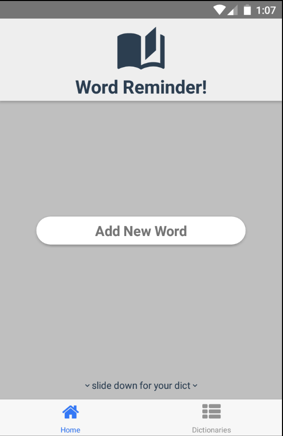
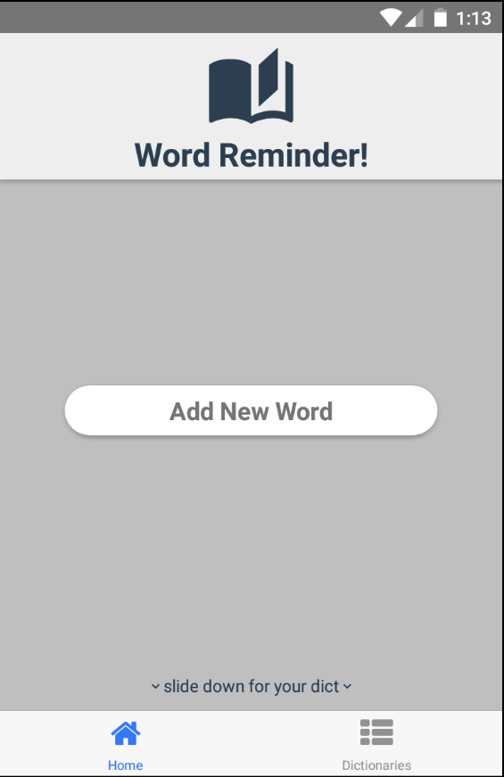

# Word Reminder
A simple vocabulary application built with React Native.

---

## **Demo**
---
</img>
</img>

## **Build**
---
1. `git clone https://github.com/metinUr/word-reminder.git && cd word-reminder`
1. `npm install` or `yarn` 
1. `react-native link` 
1. `react-native run-android` or `react-native run-ios ` 
> **note:** Didn't tested on ios yet.

## **To-Do**
---
- [x] add and delete new words
- [x] create different dictionaries
- [x] send words lerned dictionary
- [x] send words other dictionaries
- [x] delete dictionaries
- [ ] exercise words
- [ ] notifications
- [ ] stories page
- [ ] online translation
- [ ] translate stories
- [ ] compare translations with other translations
- [ ] quote tranlation and copare feature

## **License**
This project under MIT license. 
